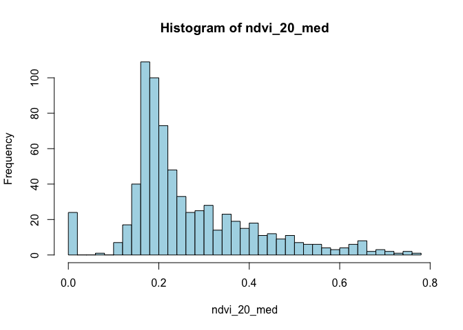
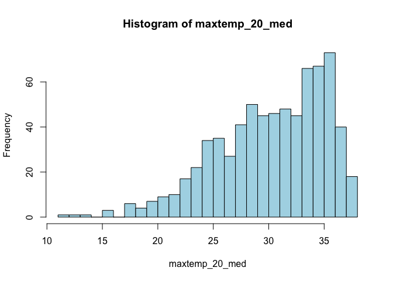
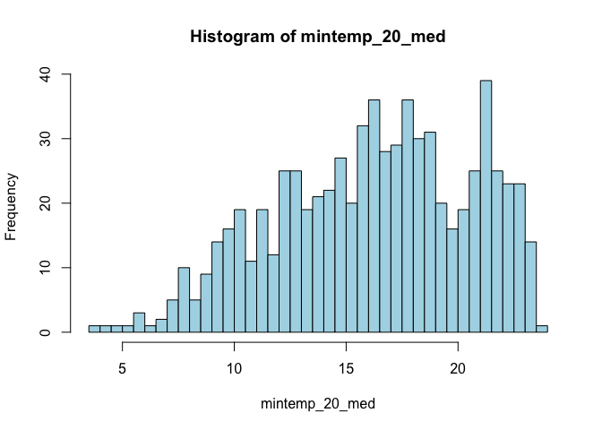
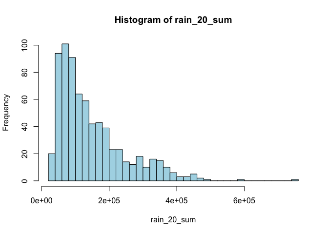
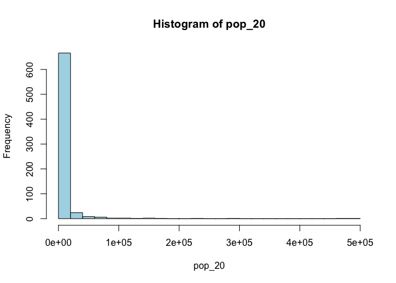
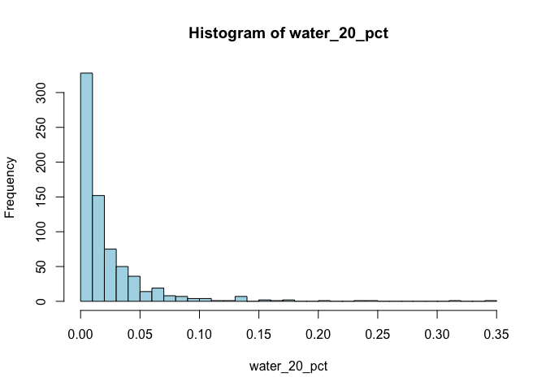
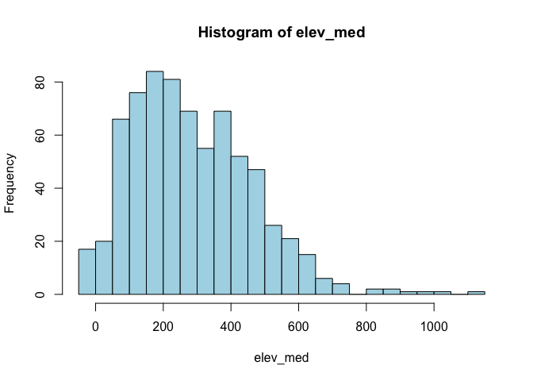
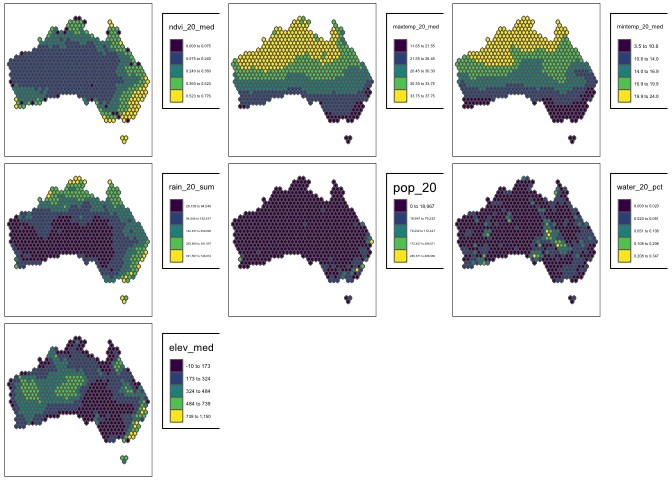
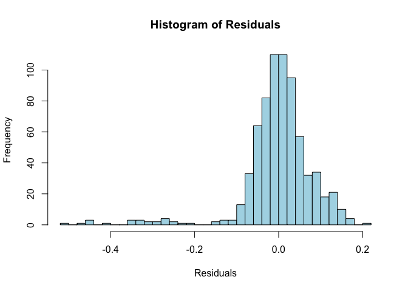
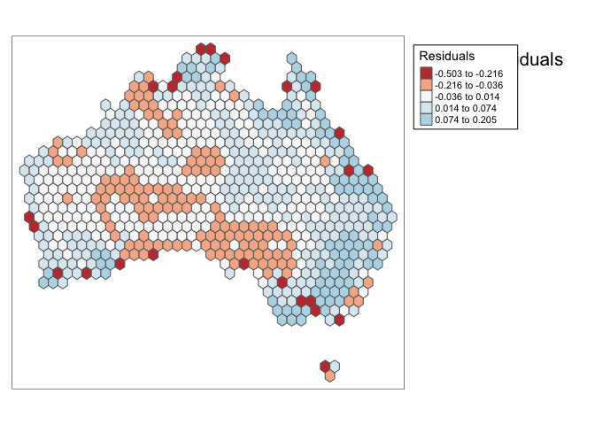

Geog6300: Lab 6
================

{Name: William Hinrichs}

## Regression

``` r
library(sf)
library(tidyverse)
library(tmap)
library(car)
```

**Overview:** This lab focuses on regression techniques. You’ll be
analyzing the association of various physical and climatological
characteristics in Australia with observations of several animals
recorded on the citizen science app iNaturalist.

\###Data and research questions###

Let’s import the dataset.

``` r
lab6_data<-st_read("data/aus_climate_inat.gpkg")
```

    ## Reading layer `aus_climate_inat' from data source 
    ##   `/Users/williamhinrichs/Desktop/GEOG4300/Lab 6/geog4-6300-lab-6-williamhinrichs-main/data/aus_climate_inat.gpkg' 
    ##   using driver `GPKG'
    ## Simple feature collection with 716 features and 22 fields
    ## Geometry type: POLYGON
    ## Dimension:     XY
    ## Bounding box:  xmin: 113.875 ymin: -43.38632 xmax: 153.375 ymax: -11.92074
    ## Geodetic CRS:  WGS 84 (CRS84)

The dataset for this lab is a 1 decimal degree hexagon grid that has
aggregate statistics for a number of variables:

- ndvi: NDVI/vegetation index values from Landsat data (via Google Earth
  Engine). These values range from -1 to 1, with higher values
  indicating more vegetation.
- maxtemp_00/20_med: Median maximum temperature (C) in 2000 or 2020
  (data from SILO/Queensland government)
- mintemp_00/20_med: Median minimum temperature (C) in 2020 or 2020
  (data from SILO/Queensland government)
- rain_00/20_sum: Total rainfall (mm) in 2000 or 2020 (data from
  SILO/Queensland government)
- pop_00/20: Total population in 2000 or 2020 (data from NASA’s Gridded
  Population of the World)
- water_00/20_pct: Percentage of land covered by water at some point
  during the year in 2000 or 2020
- elev_med: Median elevation (meters) (data from the Shuttle Radar
  Topography Mission/NASA)

There are also observation counts from iNaturalist for several
distinctively Australian animal species: the central bearded dragon, the
common emu, the red kangaroo, the agile wallaby, the laughing
kookaburra, the wombat, the koala, and the platypus.

Our primary research question is how the climatological/physical
variables in our dataset are predictive of the NDVI value. We will build
models for 2020 as well as the change from 2000 to 2020. The second is
referred to as a “first difference” model and can sometimes be more
useful for identifying causal mechanisms.

\###Part 1: Analysis of 2020 data###

We will start by looking at data for 2020.

**Question 1** *Create histograms for NDVI, max temp., min temp., rain,
and population, and water in 2020 as well as elevation. Based on these
graphs, assess the normality of these variables.*

``` r
#Code goes here
variables <- c("ndvi_20_med", "maxtemp_20_med", "mintemp_20_med", "rain_20_sum", "pop_20", "water_20_pct", "elev_med")

for (var in variables) {
  hist(lab6_data[[var]], main = paste("Histogram of", var), xlab = var, col = "lightblue", breaks = 30)}
```

<!-- --><!-- --><!-- --><!-- --><!-- --><!-- --><!-- -->

{most of the variables do not follow a normal distribution. elevaton
temps are closer to normality but still show a skew. rainfall, poulation
and water percentage are the most skewed with significant deviations
from normality.transformations might help normalize some of these
variables if needed.}

**Question 2** *Use tmap to map these same variables using Jenks natural
breaks as the classification method. For an extra challenge, use
`tmap_arrange` to plot all maps in a single figure.*

``` r
tm_list <- lapply(variables, function(var) {
  tm_shape(lab6_data) +
    tm_polygons(var, style = "jenks", palette = "viridis", title = var) +
    tm_layout(
      title = paste("Map of", var),
      title.position = c("center", "top"),  
      legend.outside = TRUE,               
      legend.outside.position = "right",
      legend.frame = TRUE)})


tmap_arrange(plotlist = tm_list)
```

    ## Legend labels were too wide. The labels have been resized to 0.24, 0.24, 0.24, 0.24, 0.24. Increase legend.width (argument of tm_layout) to make the legend wider and therefore the labels larger.
    ## Legend labels were too wide. The labels have been resized to 0.24, 0.24, 0.24, 0.24, 0.24. Increase legend.width (argument of tm_layout) to make the legend wider and therefore the labels larger.

    ## Legend labels were too wide. The labels have been resized to 0.32, 0.29, 0.29, 0.29, 0.29. Increase legend.width (argument of tm_layout) to make the legend wider and therefore the labels larger.

    ## Legend labels were too wide. The labels have been resized to 0.20, 0.19, 0.18, 0.18, 0.18. Increase legend.width (argument of tm_layout) to make the legend wider and therefore the labels larger.

    ## Legend labels were too wide. The labels have been resized to 0.30, 0.20, 0.19, 0.18, 0.18. Increase legend.width (argument of tm_layout) to make the legend wider and therefore the labels larger.

    ## Legend labels were too wide. The labels have been resized to 0.24, 0.24, 0.24, 0.24, 0.24. Increase legend.width (argument of tm_layout) to make the legend wider and therefore the labels larger.

    ## Legend labels were too wide. The labels have been resized to 0.33, 0.32, 0.32, 0.32, 0.27. Increase legend.width (argument of tm_layout) to make the legend wider and therefore the labels larger.

<!-- -->

**Question 3** *Based on the maps from question 3, summarise major
patterns you see in the spatial distribution of these data from any of
your variables of interest. How do they appear to be associated with the
NDVI variable?*

{rainfall, water pct, and moderate temperatures are positively
associated with higher NDVI values.those factors indicate favorable
conditions for vegetation growth. high max temp and low rainfall areas
in central and western correspond to lower NDVI, highlighting the impact
of arrid conditions.population density does not have a clear
relationship with NDVI , as urban areas reduce vegetation irrespective
of climate.}

**Question 4** *Create univariate models for each of the variables
listed in question 1, with NDVI in 2020 as the dependent variable. Print
a summary of each model. Write a summary of those results that indicates
the direction, magnitude, and significance for each model coefficient.*

``` r
results <- lapply(variables, function(var) {
  model <- lm(ndvi_20_med ~ lab6_data[[var]], data = lab6_data)
  summary(model)})
```

    ## Warning in summary.lm(model): essentially perfect fit: summary may be
    ## unreliable

``` r
results
```

    ## [[1]]
    ## 
    ## Call:
    ## lm(formula = ndvi_20_med ~ lab6_data[[var]], data = lab6_data)
    ## 
    ## Residuals:
    ##        Min         1Q     Median         3Q        Max 
    ## -1.511e-15 -5.100e-19  2.360e-18  6.260e-18  4.908e-17 
    ## 
    ## Coefficients:
    ##                    Estimate Std. Error    t value Pr(>|t|)    
    ## (Intercept)      -1.328e-16  4.571e-18 -2.905e+01   <2e-16 ***
    ## lab6_data[[var]]  1.000e+00  1.525e-17  6.559e+16   <2e-16 ***
    ## ---
    ## Signif. codes:  0 '***' 0.001 '**' 0.01 '*' 0.05 '.' 0.1 ' ' 1
    ## 
    ## Residual standard error: 5.723e-17 on 714 degrees of freedom
    ## Multiple R-squared:      1,  Adjusted R-squared:      1 
    ## F-statistic: 4.302e+33 on 1 and 714 DF,  p-value: < 2.2e-16
    ## 
    ## 
    ## [[2]]
    ## 
    ## Call:
    ## lm(formula = ndvi_20_med ~ lab6_data[[var]], data = lab6_data)
    ## 
    ## Residuals:
    ##      Min       1Q   Median       3Q      Max 
    ## -0.41874 -0.07657 -0.01927  0.06833  0.36382 
    ## 
    ## Coefficients:
    ##                    Estimate Std. Error t value Pr(>|t|)    
    ## (Intercept)       0.6612389  0.0294372   22.46   <2e-16 ***
    ## lab6_data[[var]] -0.0130902  0.0009601  -13.63   <2e-16 ***
    ## ---
    ## Signif. codes:  0 '***' 0.001 '**' 0.01 '*' 0.05 '.' 0.1 ' ' 1
    ## 
    ## Residual standard error: 0.1251 on 714 degrees of freedom
    ## Multiple R-squared:  0.2066, Adjusted R-squared:  0.2055 
    ## F-statistic: 185.9 on 1 and 714 DF,  p-value: < 2.2e-16
    ## 
    ## 
    ## [[3]]
    ## 
    ## Call:
    ## lm(formula = ndvi_20_med ~ lab6_data[[var]], data = lab6_data)
    ## 
    ## Residuals:
    ##      Min       1Q   Median       3Q      Max 
    ## -0.36375 -0.08418 -0.03047  0.06972  0.40383 
    ## 
    ## Coefficients:
    ##                   Estimate Std. Error t value Pr(>|t|)    
    ## (Intercept)       0.464461   0.018997   24.45   <2e-16 ***
    ## lab6_data[[var]] -0.012282   0.001131  -10.86   <2e-16 ***
    ## ---
    ## Signif. codes:  0 '***' 0.001 '**' 0.01 '*' 0.05 '.' 0.1 ' ' 1
    ## 
    ## Residual standard error: 0.1301 on 714 degrees of freedom
    ## Multiple R-squared:  0.1418, Adjusted R-squared:  0.1406 
    ## F-statistic:   118 on 1 and 714 DF,  p-value: < 2.2e-16
    ## 
    ## 
    ## [[4]]
    ## 
    ## Call:
    ## lm(formula = ndvi_20_med ~ lab6_data[[var]], data = lab6_data)
    ## 
    ## Residuals:
    ##      Min       1Q   Median       3Q      Max 
    ## -0.56681 -0.04753 -0.01210  0.04599  0.30930 
    ## 
    ## Coefficients:
    ##                   Estimate Std. Error t value Pr(>|t|)    
    ## (Intercept)      1.303e-01  7.060e-03   18.45   <2e-16 ***
    ## lab6_data[[var]] 9.124e-07  3.953e-08   23.08   <2e-16 ***
    ## ---
    ## Signif. codes:  0 '***' 0.001 '**' 0.01 '*' 0.05 '.' 0.1 ' ' 1
    ## 
    ## Residual standard error: 0.1063 on 714 degrees of freedom
    ## Multiple R-squared:  0.4273, Adjusted R-squared:  0.4265 
    ## F-statistic: 532.6 on 1 and 714 DF,  p-value: < 2.2e-16
    ## 
    ## 
    ## [[5]]
    ## 
    ## Call:
    ## lm(formula = ndvi_20_med ~ lab6_data[[var]], data = lab6_data)
    ## 
    ## Residuals:
    ##      Min       1Q   Median       3Q      Max 
    ## -0.47003 -0.07883 -0.03949  0.06384  0.48974 
    ## 
    ## Coefficients:
    ##                   Estimate Std. Error t value Pr(>|t|)    
    ## (Intercept)      2.552e-01  5.013e-03  50.902   <2e-16 ***
    ## lab6_data[[var]] 1.500e-06  1.500e-07   9.998   <2e-16 ***
    ## ---
    ## Signif. codes:  0 '***' 0.001 '**' 0.01 '*' 0.05 '.' 0.1 ' ' 1
    ## 
    ## Residual standard error: 0.1316 on 714 degrees of freedom
    ## Multiple R-squared:  0.1228, Adjusted R-squared:  0.1216 
    ## F-statistic: 99.97 on 1 and 714 DF,  p-value: < 2.2e-16
    ## 
    ## 
    ## [[6]]
    ## 
    ## Call:
    ## lm(formula = ndvi_20_med ~ lab6_data[[var]], data = lab6_data)
    ## 
    ## Residuals:
    ##      Min       1Q   Median       3Q      Max 
    ## -0.26898 -0.08838 -0.04838  0.06871  0.50911 
    ## 
    ## Coefficients:
    ##                   Estimate Std. Error t value Pr(>|t|)    
    ## (Intercept)       0.268988   0.006287  42.781   <2e-16 ***
    ## lab6_data[[var]] -0.178263   0.154480  -1.154    0.249    
    ## ---
    ## Signif. codes:  0 '***' 0.001 '**' 0.01 '*' 0.05 '.' 0.1 ' ' 1
    ## 
    ## Residual standard error: 0.1403 on 714 degrees of freedom
    ## Multiple R-squared:  0.001862,   Adjusted R-squared:  0.0004636 
    ## F-statistic: 1.332 on 1 and 714 DF,  p-value: 0.2489
    ## 
    ## 
    ## [[7]]
    ## 
    ## Call:
    ## lm(formula = ndvi_20_med ~ lab6_data[[var]], data = lab6_data)
    ## 
    ## Residuals:
    ##      Min       1Q   Median       3Q      Max 
    ## -0.27082 -0.09585 -0.04270  0.07954  0.44272 
    ## 
    ## Coefficients:
    ##                   Estimate Std. Error t value Pr(>|t|)    
    ## (Intercept)      2.138e-01  9.741e-03  21.952  < 2e-16 ***
    ## lab6_data[[var]] 1.787e-04  2.895e-05   6.171 1.14e-09 ***
    ## ---
    ## Signif. codes:  0 '***' 0.001 '**' 0.01 '*' 0.05 '.' 0.1 ' ' 1
    ## 
    ## Residual standard error: 0.1369 on 714 degrees of freedom
    ## Multiple R-squared:  0.05064,    Adjusted R-squared:  0.04931 
    ## F-statistic: 38.08 on 1 and 714 DF,  p-value: 1.136e-09

{most are highly significant with a p value of p\<0.001, except for 6,
where the value is not statistically significant at p\<0.249. 4,5,7
indicate the independent variable has minimal impact on NDVI. The
highest explanatory power is observed in 4(42.73%), and the lowest is 6
with 0.186%. 1,4,5,and 6 have positive effects, however, 2,3,6 have
negative effects.}

**Question 5** *Create a multivariate regression model with the
variables of interest, choosing EITHER max or min temperature (but not
both) You may also choose to leave out any variables that were
insignificant in Q4. Use the univariate models as your guide. Call the
results.*

``` r
#Code goes here
multi_model <- lm(ndvi_20_med ~ maxtemp_20_med + rain_20_sum + pop_20 + water_20_pct + elev_med, data = lab6_data)
summary(multi_model)
```

    ## 
    ## Call:
    ## lm(formula = ndvi_20_med ~ maxtemp_20_med + rain_20_sum + pop_20 + 
    ##     water_20_pct + elev_med, data = lab6_data)
    ## 
    ## Residuals:
    ##      Min       1Q   Median       3Q      Max 
    ## -0.50306 -0.02849  0.00444  0.03912  0.20545 
    ## 
    ## Coefficients:
    ##                  Estimate Std. Error t value Pr(>|t|)    
    ## (Intercept)     4.591e-01  2.272e-02  20.206  < 2e-16 ***
    ## maxtemp_20_med -1.173e-02  6.834e-04 -17.160  < 2e-16 ***
    ## rain_20_sum     8.464e-07  3.269e-08  25.887  < 2e-16 ***
    ## pop_20          2.873e-07  1.045e-07   2.749  0.00613 ** 
    ## water_20_pct   -3.387e-02  9.717e-02  -0.349  0.72750    
    ## elev_med        1.215e-04  1.862e-05   6.526 1.28e-10 ***
    ## ---
    ## Signif. codes:  0 '***' 0.001 '**' 0.01 '*' 0.05 '.' 0.1 ' ' 1
    ## 
    ## Residual standard error: 0.08455 on 710 degrees of freedom
    ## Multiple R-squared:  0.6397, Adjusted R-squared:  0.6372 
    ## F-statistic: 252.1 on 5 and 710 DF,  p-value: < 2.2e-16

**Question 6** *Summarize the results of the multivariate model. What
are the direction, magnitude, and significance of each coefficient? How
did it change from the univariate models you created in Q4 (if at all)?
What do the R2 and F-statistic values tell you about overall model fit?*

{The model provides a substantial portion of the variance in NDVI.the
high R value (0.6397 adjusted 0.6372) and the F statistic (252.1 on 5
and 710 DF) suggest that chosen predictors are appropriate for modeling
NDVI. 1.intercept - estimate is 0.4591, the interpretation is when all
independent variables are at 0, the NDVI is predicted to be 0.4591. the
significance is highly significant with p\<2x10e-16 2. maxtemp_20_med -
Direction is negative, magnitude is a 1 degree C increase in max temp is
associated with a -0.01173 decrease in NDVI. the significance is highly
significant (p\< 2x10e-16 3.Rain_20_sum - Direction is positive,
magnitude is 8.464x10e-7, which rainfall is associated with a slight
increase in NDVI. the significance is highly significant with a value od
p\<2x10e-16. 4.pop_20 - Direction is positive, magnitude is 2.873x10e-7
which a one person increase in population is associated with a small
increase in NDVI. Significance is significant with p=0.00613
5.water_20_pct - Direction is negative, magnitude is -0.03387, which an
increase in water coverage is associated with a decrease in NDVI.
Significance is not significant with p=0.7275. 6.elev_med - Direction is
positive, magnitude is 0.0001215 with an increase in elevation is
associated with a small increase in NDVI. significance is highly
significant with p-1.28x10e-10.}

**Question 7** *Use a histogram and a map to assess the normality of
residuals and any spatial autocorrelation. Summarise any notable
patterns that you see.*

``` r
#Code goes here
lab6_data$residuals <- residuals(multi_model)

residuals <- as.numeric(residuals(multi_model))

hist(residuals, main = "Histogram of Residuals", xlab = "Residuals", col = "lightblue", breaks = 30)
```

<!-- -->

``` r
tm_shape(lab6_data) +
  tm_polygons("residuals", style = "jenks", palette = "RdBu", midpoint = 0, title = "Residuals") +
  tm_layout(
    title = "Map of Residuals",
    title.position = c("center", "top"),
    legend.outside = TRUE,
    legend.outside.position = "right",
    legend.frame = TRUE)
```

<!-- -->

{The residuals are generally symmetric and centered around zero,
indicating a good overall mode fit. However, there are slight deviations
from normality, with a longer left tail and a few outliers on both
extremes. These outliers suggest the model may struggle with extreme
cases, but the concentration of residuals near zero reflects strong
performance for most observations}

**Question 8** *Assess any issues with multicollinearity or
heteroskedastity in this model using the techniques shown in class. Run
the appropriate tests and explain what their results show you.*

``` r
#Code goes here
vif(multi_model)
```

    ## maxtemp_20_med    rain_20_sum         pop_20   water_20_pct       elev_med 
    ##       1.109442       1.081126       1.174874       1.090059       1.084266

``` r
ncvTest(multi_model)
```

    ## Non-constant Variance Score Test 
    ## Variance formula: ~ fitted.values 
    ## Chisquare = 287.3917, Df = 1, p = < 2.22e-16

{the values are between 1.08 and 1.17, which are wll below the typical
threshold that indicates potential multicollinearity, which is not a
concern in this model, as the predictors are not strongly correlated
with eachother. the ncvtect has a chi square test value of 287.39. the
DF is 1 and the p value is p\<2.22x10e-16, indicating a highly
significant result. the test identifies a violation of the
homoscedasticity assumption, meaning the variance of the residuals is
not constant across fitted values. this suggests heteroskedasicity in
the model.}

**Question 9** *How would you summarise the results of this model in a
sentence or two? In addition, looking at the full model and your
diagnostics, do you feel this is a model that provides meaningful
results? Explain your answer.*

{Yes, the model provides meaningful results as it captures key
predictors of NDVI and explains a substantial portion of the variance.
However, the heteroskedasticity issue highlights potential limitations
with the reliability of standard errors and significance tests.
Adjustments, such as using robust standard errors or alternative models,
could enhance its interpretability and validity.}

**Disclosure of assistance:** *Besides class materials, what other
sources of assistance did you use while completing this lab? These can
include input from classmates, relevant material identified through web
searches (e.g., Stack Overflow), or assistance from ChatGPT or other AI
tools. How did these sources support your own learning in completing
this lab?*

{I was having issues with creating the histogram for the residuals and
kept getting a figure margins too large warning. i used ChatGPT for a
reference code to figure out why the residuals were not coming up in my
lab6_data so i could make a histogram. I saw the residuals were not in
the df, and made the adjustments after looking at both the code and the
df. I used additional references such as CRAN and a couple work
colleagues which are data scientists to check my work. The individuals
at work helped me change a couple parts of question 7 i was having
issues with. I also used chatGPT to check some parts of my code that I
had issues with, and had one or two small things, like a simple mistype
such as a misspelling and a capital letter where it did not need to be.
using all these references have helped my with my work but start working
on projects for my research topic as well. I also see that peers with
more experience helped me more with this lab, and helped me see that
chatGPT may be a decent reference, but using peers with years of
experience can be more reliable.}

**Lab reflection:** *How do you feel about the work you did on this lab?
Was it easy, moderate, or hard? What were the biggest things you learned
by completing it?*

{This lab was quite challenging, but I managed to complete it. It was
moderate with a few hard parts, which to me is good. I learned the
regression techniques is one thing I will definitely need to do more to
become more familiar with the results and how other results factor into
my work.}

**Challenge question**

\#Option 1 Create a first difference model. To do that, subtract the
values in 2000 from the values in 2020 for each variable for which that
is appropriate. Then create a new model similar to the one you created
in question 5, but using these new variables showing the *change in
values* over time. Call the results of the model, and interpret the
results in the same ways you did above. Also chart and map the residuals
to assess model error. Finally, write a short section that summarises
what, if anything, this model tells you.

\#Option 2 The animal data included in this dataset is an example of
count data, and usually we would use a Poisson or similar model for that
purpose. Let’s try it with regular OLS regression though. Create two
regression models to assess how the counts of two different animals
(say, koalas and emus) are associated with at least three of the
environmental/climatological variables given above. Be sure to use the
same independent variables in each model. Interpret the results of each
model and then explain the importance of any differences in the model
coefficients between them, focusing on direction, magnitude, and
significance.

``` r
Koala_model <- lm(Koala ~ maxtemp_20_med + rain_20_sum + pop_20, data = lab6_data)
wombat_model <- lm(Wombat ~ maxtemp_20_med + rain_20_sum + pop_20, data = lab6_data)

summary(Koala_model)
```

    ## 
    ## Call:
    ## lm(formula = Koala ~ maxtemp_20_med + rain_20_sum + pop_20, data = lab6_data)
    ## 
    ## Residuals:
    ##     Min      1Q  Median      3Q     Max 
    ## -1291.7    -5.2     6.5    13.8  6385.0 
    ## 
    ## Coefficients:
    ##                  Estimate Std. Error t value Pr(>|t|)    
    ## (Intercept)    -4.376e+01  6.388e+01  -0.685    0.493    
    ## maxtemp_20_med  7.580e-01  2.034e+00   0.373    0.710    
    ## rain_20_sum     9.630e-05  9.737e-05   0.989    0.323    
    ## pop_20          2.644e-03  3.124e-04   8.462   <2e-16 ***
    ## ---
    ## Signif. codes:  0 '***' 0.001 '**' 0.01 '*' 0.05 '.' 0.1 ' ' 1
    ## 
    ## Residual standard error: 252.9 on 712 degrees of freedom
    ## Multiple R-squared:  0.1098, Adjusted R-squared:  0.1061 
    ## F-statistic: 29.28 on 3 and 712 DF,  p-value: < 2.2e-16

``` r
summary(wombat_model)
```

    ## 
    ## Call:
    ## lm(formula = Wombat ~ maxtemp_20_med + rain_20_sum + pop_20, 
    ##     data = lab6_data)
    ## 
    ## Residuals:
    ##     Min      1Q  Median      3Q     Max 
    ## -272.77  -16.56   -0.52   10.97  835.91 
    ## 
    ## Coefficients:
    ##                  Estimate Std. Error t value Pr(>|t|)    
    ## (Intercept)     8.585e+01  1.715e+01   5.007 6.99e-07 ***
    ## maxtemp_20_med -3.421e+00  5.460e-01  -6.266 6.40e-10 ***
    ## rain_20_sum     1.634e-04  2.614e-05   6.251 7.02e-10 ***
    ## pop_20          4.588e-04  8.386e-05   5.470 6.22e-08 ***
    ## ---
    ## Signif. codes:  0 '***' 0.001 '**' 0.01 '*' 0.05 '.' 0.1 ' ' 1
    ## 
    ## Residual standard error: 67.9 on 712 degrees of freedom
    ## Multiple R-squared:  0.1892, Adjusted R-squared:  0.1858 
    ## F-statistic: 55.38 on 3 and 712 DF,  p-value: < 2.2e-16

{Both models show a positive association. between population density and
animal counts. rainfall a positive effect in both models, but the effect
is significant for wombats but not for koalas. the magnitude for koalas
is stronger for koalas (0.002644) compared to wombats (0.0004588). the
rainfall has a stronger impact on wombat counts than the koala counts as
well. the coefficient for the wombats is 1.634x10e-4. wombats counts are
influenced significantly all three predictors (max temp, rainfall and
population). koalas are only significantly influenced only by
population. Overall, the differences highlight the distinct ecological
and environmental factors influencing koalas and wombats, emphasizing
the need for species-specific conservation strategies.}
